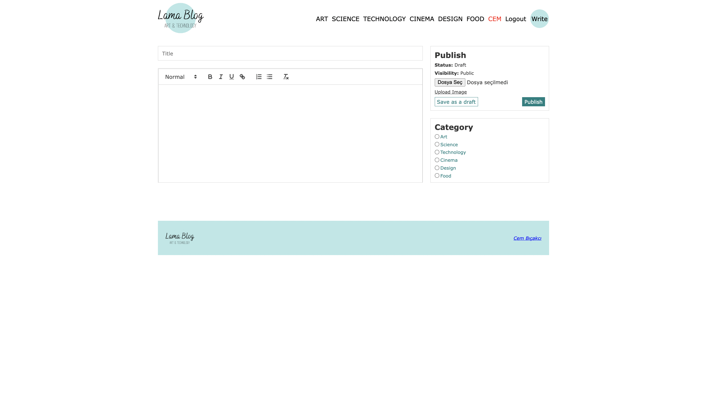
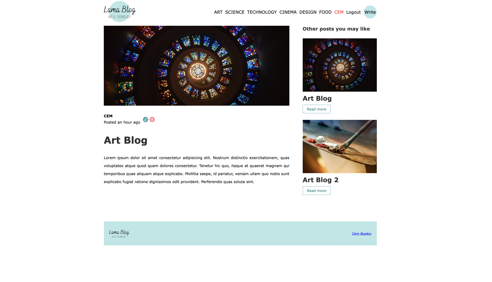

# Blog Post App with React-MySql

## Tools
* React
* MySql DataBase
* Sass
* React-Router-Dom
* React-Quill
* Axios
* Moment
* Jsonwebtoken

## Features
* You can login/register
* You can write a post and edit/delete if you are the owner that post

